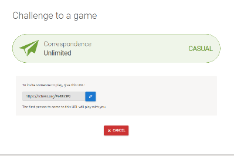

# Lichess-Bot

Created a Python bot to automatically make a move against an online friend on *[lichess.org](https://lichess.org/)*.


It uses computer vision from OpenCV libraries to detect new moves and updates a Stockfish engine, which then returns the best possible move.


## How it to use
##### Context
If your friend invites you to a chess game, they will send you a URL to go to.
When you click the URL, you will be redirected to a game that is set up.



> Example URL: https://lichess.org/PeSBs5Pz

##### Update the source code

Replace the old URL with the new URL you received on line 25 of main.py
```py
if opponent == "friend":
    url = "https://lichess.org/y34LNYqy"  # Replace this url (line 25)
```
Now save the file. 

##### Watch the automation

You now can run _main.py_ either in command line or your IDE.

An emulated browser will now pop up and you can now spectate your opponent being crushed by the Stockfish AI.

## Structure
### Main
The main method creates a thread to run a custom Bot class instance. 

### Bot class
The bot emulates a human person sitting behind the computer clicking the screen to move a piece.

### Board class
Board class contains methods which the bot can use as a guide for working out and understand the screen.

It acts as a translator from an alien image of a chess board to the language of which a chess engine understands.

### Engine class
Allows interaction and connection to the Stockfish Engine.

## How it works

#### Start
At the start, if the bot is:

#### White
1. It will make a move 
2. Wait for the next turn

#### Black
1. Wait for the next turn

Then it will loop continuously until the game is over.

#### Inside the loop

The bot sits and waits until it is their turn.

**If the opponent has finally made a move then the bot will use the following methods.**


### 1. Identify last move
Save a .png screenshot image of the chessboard to analyse.


The last move is always highlighted with a green square.

1. Create a mask of all green objects.
   Dark green mask | Light green mask
    | 


2. Detect all squares and get centre co-ordinates of old square and new square
   - Old square is empty
   - New square has a piece

2. Generate a UCI chess notation string from the following conversions
   1. Co-ordinates: (350, 650) to (350, 450)
   
   2. Tuples: (4, 2) to (4, 6)
   
   3. File-Rank: D2 to D4 
   
   Final output:
   > d2d4

### 2. Figure out best move

We now have a UCI notation that the chess engine understands.

1. The Stockfish engine is fed the new move to update the positions.

2. The bot asks for the next best move and is replied with another chess notation.

   > e7e5


### 3. Make the move

1. The bot uses the same conversion methods in the board class but now in the opposite order.
   1. File-Rank: E7 to E5 
   
   2. Tuples: (5, 7) to (5, 5)
   
   3. Co-ordinates: (450, 550) to (450, 750)
   
   Final output:
   > Current square: (450, 550) 

   > New Square: (450, 750)

2. The bot clicks on the browser given the two square co-ordinates.
    ```py
       self.click_coords(old_square)
       time.sleep(0.1)  # Wait 0.1 seconds
       self.click_coords(new_square)
    ```

3. It updates the engine after it has moved.

*It now delves into a light slumber awaiting the opponents next move...*

## Specifics **_(TODO)_**

### Understanding logic of old square and new square

### OpenCV contours and central points of bounding box

### Castling

### Pawn Promotion

### Checks

## Debugging and solving encountered problems **_(TODO)_**

### Diagonal mask
- Same colour green
- Erode outline

## Improvements and additional features **_(TODO)_**
#### Play against online players
#### Play against computer
#### Simple UI to initiate program
- Update settings
- Enter URL
- Play against player or computer
#### Additional settings
- Live update of Stockfish AI level
- Manual move
- Multiple bots running simultaneously

## Libaries and tools
Main libraries
* [Selenium](https://pypi.org/project/selenium/) - Browser Emulation: [Docs](https://selenium-python.readthedocs.io/)
* [OpenCV](https://pypi.org/project/opencv-python/) - Computer Vision: [Docs](https://opencv-python-tutroals.readthedocs.io/en/latest/py_tutorials/py_tutorials.html)
* [Stockfish](https://pypi.org/project/stockfish/) - Chess Engine (API): [Engine DL](https://stockfishchess.org/)


## Author
Jeremy Tang
